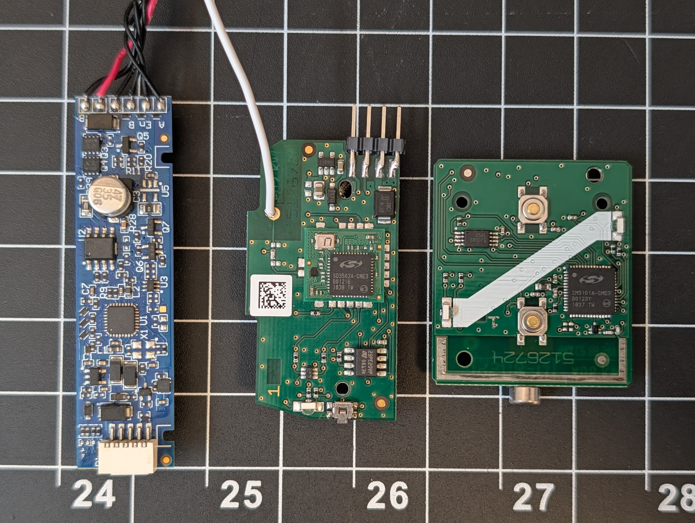
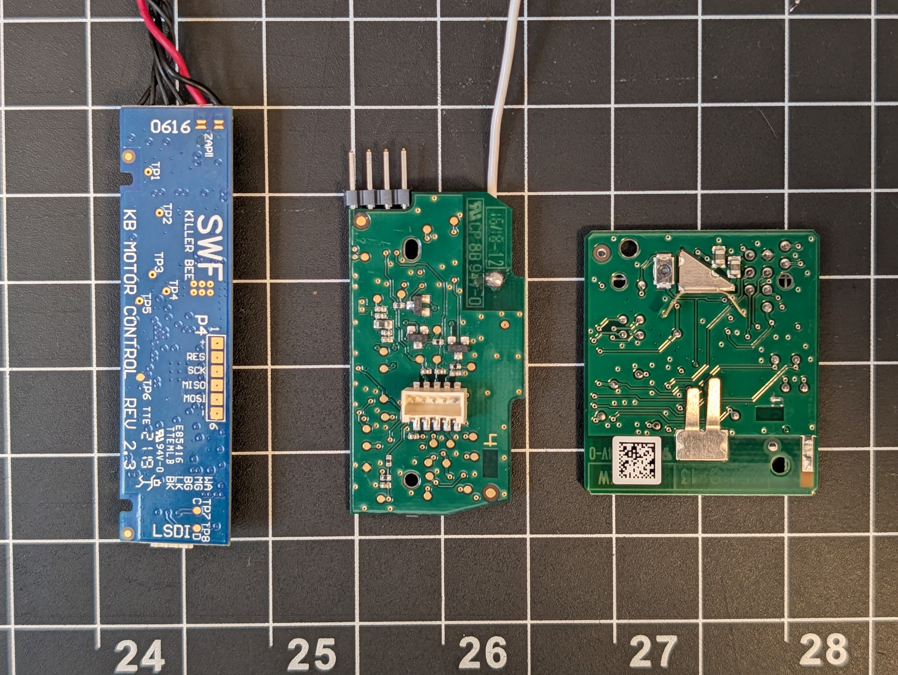

# Reverse-Engineering Springs Window Fashions Z-Wave Blinds

Reverse-engineering notes, memory dumps, and analysis tooling for the **Z-Wave
motorized blind** sold under the **blinds.com**, **Springs Window Fashions**, and
**Graber** brands (a Somfy technology partner; Z-Wave Manufacturer ID `0x026E`).

The system is three boards across two enclosures:

```
   ┌────────────────┐                      ┌──────────────────────────────────┐
   │  VCZ1 remote   │     Z-Wave RF        │           inside the blind        │
   │  (2 buttons)   │ ───────────────────▶ │  ┌───────────┐    I²C / SMBus     │
   │   ZM5101       │   blind ↔ controller │  │   CSZ1    │   5-pin cable      │
   └────────────────┘                      │  │ controller│ ─────────────────▶ │
                                           │  │  ZM5202   │   ┌──────────────┐  │
                                           │  └───────────┘   │  Killer Bee  │  │
                                           │                  │ motor control│──┼─▶ motor
                                           │                  │  ATmega168P  │  │
                                           │                  └──────────────┘  │
                                           └──────────────────────────────────┘
```

- **[VCZ1](vcz1-remote/)** — *Virtual Cord Control*, the **two-button handheld
  Z-Wave remote** (ZM5101 module). Pairs to the CSZ1 over Z-Wave RF.
- **[CSZ1](csz1-control-board/)** — *Cellular Shade Radio*, the **Z-Wave
  controller inside the blind** (ZM5202 module). It is the Z-Wave endpoint the
  remote/hub talks to, and the **I²C master** that drives the motor board.
- **[Killer Bee](killer-bee-motor-controller/)** — *SWF Killer Bee Motor Control
  Rev 2.3*, an **ATmega168P** motor controller. Drives the DC motor and answers
  the CSZ1 as an **I²C slave @ 0x0B**.

Two links carry the whole system: the **VCZ1 ↔ CSZ1 link is Z-Wave RF**, and the
**CSZ1 ↔ Killer Bee link is a bit-banged I²C / SMBus bus** over a 5-pin cable
inside the blind.

## The three boards



Component side, left → right: the **Killer Bee** motor board (blue), the **CSZ1**
controller (green — note the Z-Wave antenna wire and the programming pins), and
the **VCZ1** remote (green, right).



Solder side, same order. The Killer Bee silk reads *SWF / KILLER BEE / KB MOTOR
CONTROL / REV 2.3*; the CSZ1's white 5-pin connector (center) is the cable to the
motor board. These two group shots are currently the only photos of the VCZ1
remote PCB.

## Documentation

| Doc | Scope |
|:--|:--|
| **[vcz1-remote/README.md](vcz1-remote/README.md)** | VCZ1 remote — purpose, hardware (ZM5101 + CAV25256 EEPROM), firmware/NVM dump |
| **[csz1-control-board/README.md](csz1-control-board/README.md)** | CSZ1 controller — purpose, hardware (ZM5202/SD3502 + M25PE20 flash), external-NVM and internal-flash dumps, Ghidra load |
| **[killer-bee-motor-controller/README.md](killer-bee-motor-controller/README.md)** | Killer Bee motor board — purpose, hardware (ATmega168P), firmware dump, motor drive, position sensing, I²C slave side |
| **[docs/PROTOCOL.md](docs/PROTOCOL.md)** | The CSZ1 ↔ Killer Bee inter-board protocol (bit-banged I²C / SMBus, command map, move/position semantics) — the one cross-component doc |

## Devices at a glance

| | VCZ1 (remote) | CSZ1 (controller) | Killer Bee (motor) |
|:--|:--|:--|:--|
| Product name | Virtual Cord Control | Cellular Shade Radio | SWF Killer Bee Motor Control Rev 2.3 |
| Role | 2-button Z-Wave remote | In-blind Z-Wave controller / I²C master | Motor driver / I²C slave |
| Main IC | ZM5101 (ZW0500, 8051) | ZM5202 / **SD3502** (ZW0500, 8051) | **ATmega168P** (AVR) |
| External memory | CAV25256 SPI EEPROM (32 KiB) | M25PE20 SPI flash (256 KiB) | on-chip (512 B EEPROM) |
| Talks to | CSZ1 (Z-Wave RF) | VCZ1 (Z-Wave) + Killer Bee (I²C) | CSZ1 (I²C @ 0x0B) |
| Z-Wave Mfr ID | `0x026E` | `0x026E` | — |
| Product Type / ID | `0x5643 0x5A31` ("VCZ1") | `0x4353 0x5A31` ("CSZ1") | — |
| Z-Wave cert | [ZC10-16055082][zwa-vcz1] | [ZC10-16055081][zwa-csz1] | — |
| FCC ID | DWNVCZ | DWNCSZ | — |

Neat detail: the vendor encodes the **SKU as ASCII inside the 16-bit Z-Wave
Product Type / Product ID fields**, so each Z-Wave device "names itself" in a hex
dump — `0x4353 0x5A31` = `"CSZ1"`, `0x5643 0x5A31` = `"VCZ1"` (VC = *Virtual
Cord*, CS = *Cellular Shade*).

## Repository layout

```
README.md                          this file — project overview + index
docs/
  PROTOCOL.md                      CSZ1 ↔ Killer Bee I²C/SMBus protocol
vcz1-remote/                       VCZ1 2-button remote
  README.md                          component doc (HW + FW)
  cav25256.bin                       32 KiB SPI EEPROM dump
  nvm.hexpat                         ImHex pattern for the dump
  tools/                             pyftdi scripts to read the EEPROM
  images/                            board / device photos
csz1-control-board/                CSZ1 in-blind controller
  README.md                          component doc (HW + FW)
  m25pe20.bin                        256 KiB external SPI flash dump
  sd3502_internal.bin                128 KiB SD3502 internal flash dump
  sd3502_nvr.bin                     SD3502 NVR dump
  nvm.hexpat                         ImHex pattern for the external flash
  captures/                          logic-analyzer .sal/.csv of the motor I²C bus
  tools/                             SD3502 programming-FSM reader + Ghidra loader
  images/                            board / device photos
killer-bee-motor-controller/       Killer Bee ATmega168P motor board
  README.md                          component doc (HW + FW)
  flash.bin                          16 KiB flash image
  eeprom.bin                         512 B EEPROM
  {l,h,e}fuse.txt, lock.txt          fuse / lock byte reads
  images/                            board / device photos
shared/
  includes/                          shared ImHex types (#include'd by both patterns)
```

## Shared tooling

### ImHex patterns (NVM dumps)

The CSZ1 and VCZ1 dumps share the same Z-Wave NVM record structure, so both
`nvm.hexpat` files `#include` from `shared/includes/`. ImHex resolves `#include`
from an `includes/` subfolder on a configured pattern path — add this repo's
**`shared/`** folder under **ImHex → Extras → Settings → Folders** (ImHex then
looks in `shared/includes/`), then open a dump and load the matching `nvm.hexpat`.

### Dump integrity

Every dump in this repo was **read twice and compared by SHA-256**, and where a
known structure exists (e.g. the 8051 vector table, the AVR fuse bytes) it was
cross-checked. Treat a single unverified read as suspect.

## References

- CSZ1 — [Cellular Shade Radio Z-Wave][zwa-csz1] (cert ZC10-16055081)
- VCZ1 — [Virtual Cord Remote Control Z-Wave][zwa-vcz1] (cert ZC10-16055082)
- [SWF Cellular/Pleated Shade Installation Instructions][install] — pairing,
  limit setting, and remote operation procedures

Component datasheets and the per-device programming/dump references live in each
component's README.

[zwa-csz1]: https://products.z-wavealliance.org/z-wave-product/cellular-shade-radio-z-wave/
[zwa-vcz1]: https://products.z-wavealliance.org/z-wave-product/virtual-cord-remote-control-z-wave/
[install]: https://media.blinds.com/pdfs/SWF_CellPleated_InstallationInstructions.pdf

---

> Not affiliated with Springs Window Fashions, Graber, blinds.com, or Somfy. For
> interoperability and research on hardware the author owns.
