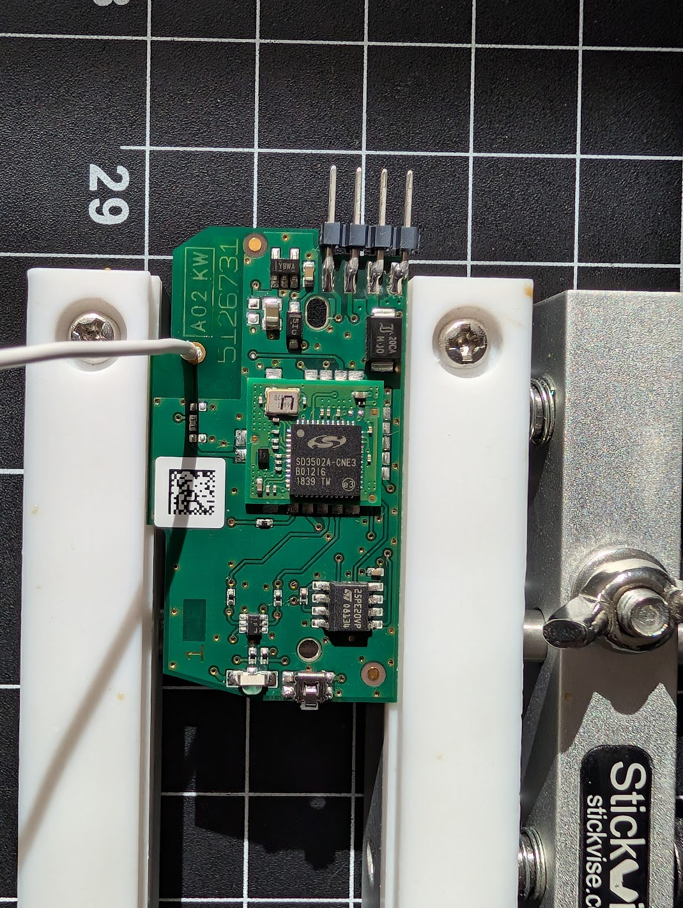
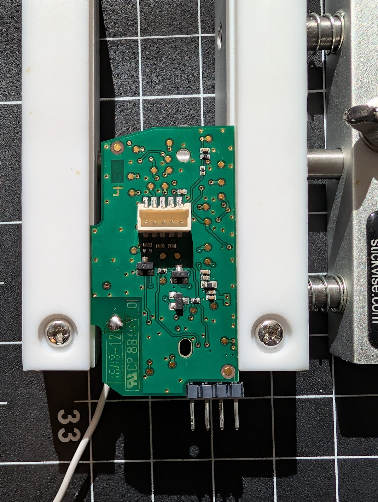
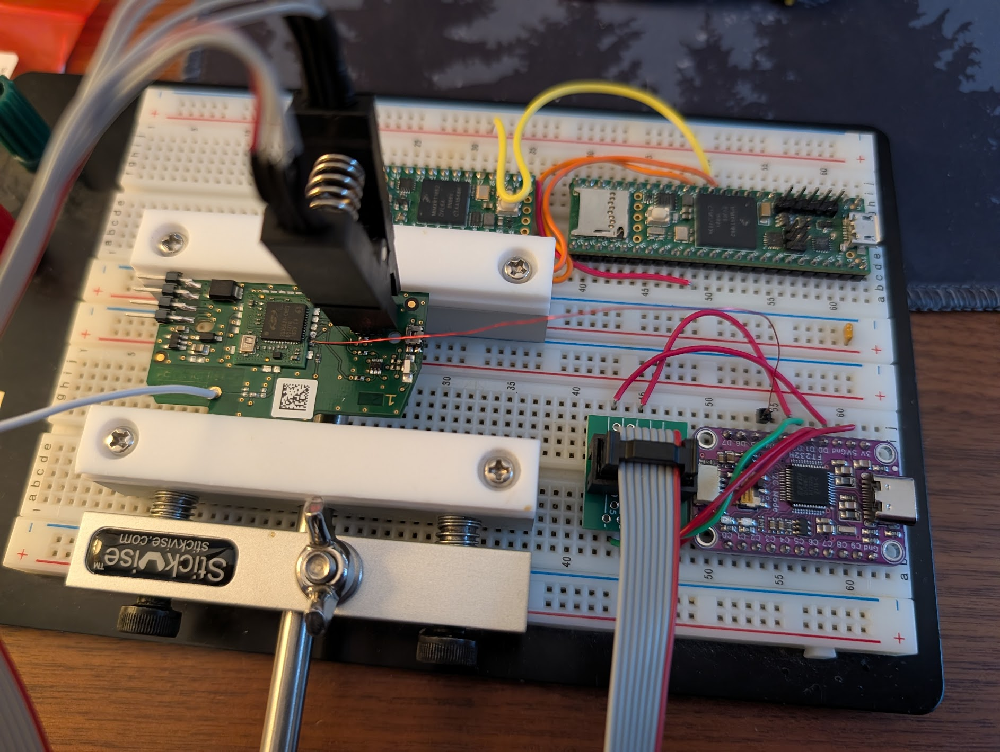

# CSZ1 — Cellular Shade Radio (in-blind Z-Wave controller)

The **CSZ1** is the **Z-Wave controller board inside the blind** — the "brain" of
the system. It is the Z-Wave endpoint the [VCZ1 remote](../vcz1-remote/README.md)
(or a hub) talks to over RF, and it is the **I²C master** that drives the
[Killer Bee motor board](../killer-bee-motor-controller/README.md) over a 5-pin
cable (see the [protocol doc](../docs/PROTOCOL.md)). This document covers its
purpose, silicon, the two memories that were dumped (external SPI flash and the
SD3502's internal flash), and the Ghidra setup for the firmware.

Part of the [Springs Window Fashions Z-Wave blind project](../README.md).

> Status: chip identities, pinout, both dump procedures, and the
> manufacturer/serial records are **confirmed**. The SD3502 internal flash readback
> turned out **not** to be lock-protected, so the application firmware was dumped
> and loaded into Ghidra. The finer external-NVM layout (identity block, `field2`,
> TLV framing) is partially inferred — see *Open items*.

## Overview

| | CSZ1 |
|:--|:--|
| Z-Wave product | Cellular Shade Radio (in-blind controller) |
| Role | Z-Wave endpoint + **I²C master** to the motor board |
| Z-Wave module | [**ZM5202**][ds-zm5202] (12.5×13.6 mm) |
| SoC | Sigma/SiLabs **SD3502** (ZW0500, 500-series, 8051 core) |
| External memory | **Micron/ST M25PE20** SPI flash, 2 Mbit / **256 KiB** |
| On-chip memory | SD3502 internal flash (128 KiB) + NVR |
| Manufacturer ID | `0x026E` |
| Product Type ID | `0x4353` ("CS") |
| Product ID | `0x5A31` ("Z1") |
| Z-Wave Alliance cert | [ZC10-16055081][zwa-csz1] |
| FCC ID | DWNCSZ |
| Z-Wave version | 6.61.00 (certified protocol) |
| Firmware | 187.65:1.09; app self-reports `"Z-Wave 4.33"` |

Other board features: a push-button, a two-color LED, and a battery power
section. The unit runs from **8× AA in series** (≈12 V nominal, unregulated). The
5-pin cable to the motor board carries ENABLE, I²C SDA/SCL, GND, and that raw
battery VCC (pinout in the [protocol doc](../docs/PROTOCOL.md)).

## Photos



Top side. The chip marked `SD3502A-CME3` (under the Sigma/SiLabs logo) is the
Z-Wave SoC; the white wire is the antenna. The 4-pin header soldered at the top
edge is **not original** — it's a tap added in place of the board's USB-micro jack
(see below). Datamatrix + serial `5126731…` at left.



Bottom side. The white 5-pin connector (center) is the inter-board cable to the
[Killer Bee](../killer-bee-motor-controller/README.md); the 4-pin header at the
bottom edge is the same added USB-jack tap.



Reading the board on the bench: an SOIC-8 chip-clip on the module's SPI1 bus with
an **FT232H** (purple, lower right) in MPSSE SPI mode — the rig used both for the
M25PE20 flash read and the SD3502 programming-FSM dump.

## Hardware

### M25PE20 — external SPI flash

JEDEC RDID `20 80 12` (Micron/ST, "PE" page-erase family, 2 Mbit). On the ZM5202
module this is the **OTA / NVM flash on the SoC's SPI1 bus** (module pins 7/8/9 =
MISO/SCK/MOSI). Datasheet: [AT25PE20][ds-pe20] (the equivalent Renesas/Adesto PE20
part; pin- and command-compatible).

#### Pinout → FT232H wiring

Standard 8-pin 25-series SPI pinout. WP#, RESET#, and VCC all tie to **3.3 V** (the
FT232H **3V** pin — **never 5V**).

| SPI pin # | M25PE20 | Function | → FT232H |
|:---------:|:--------|:---------|:--------:|
| 1 | CS#    | Chip select | D3 |
| 2 | SO     | Serial out (MISO) | D2 |
| 3 | WP#    | Write protect | 3V |
| 4 | VSS    | Ground | GND |
| 5 | SI     | Serial in (MOSI) | D1 |
| 6 | SCK    | Serial clock | D0 |
| 7 | RESET# | Reset | 3V |
| 8 | VCC    | Power | 3V |

## Firmware

The CSZ1 has **two** distinct memories worth dumping:

1. The **external M25PE20 SPI flash** — OTA image staging + Z-Wave NVM (identity,
   serial, manufacturer record). Read with flashrom.
2. The **SD3502 internal flash** — the actual Z-Wave application firmware (8051),
   plus the protocol version and device icons. Read via the Sigma/SiLabs
   500-series programming FSM.

### Reading the external M25PE20 flash (flashrom)

Programmer: **FT232H breakout in MPSSE SPI mode** (D0=SCK, D1=MOSI, D2=MISO,
D3=CS0).

```bash
# Identify (force the chip type; flashrom lists it as "unknown" otherwise)
flashrom -p ft2232_spi:type=232H,divisor=10 -c M25PE20

# Dump (read twice, compare hashes)
flashrom -p ft2232_spi:type=232H,divisor=10 -c M25PE20 -r dump1.bin
flashrom -p ft2232_spi:type=232H,divisor=10 -c M25PE20 -r dump2.bin
sha256sum dump1.bin dump2.bin
```

> **Critical gotcha — in-circuit bus contention.** Read in-circuit on the control
> board, the ZW0500 SoC powers up (back-fed through the flash's VCC pin) and drives
> the shared SPI bus, fighting the FT232H. Symptom: garbage / unstable RDID, or
> `0xFF`. **Fix: hold the ZM5202 `RESET_N` pin (module pin 2) to GND** for the
> whole read — this tri-states the SoC's SPI pins and frees the bus. The hold must
> be *solid and continuous* (a tapped reset just makes the SoC reboot). A clean
> read shows a **stable** ID across repeated probes. `divisor=10` (~6 MHz) keeps
> the slow/long breadboard wiring reliable.

#### What's in the external dump

`m25pe20.bin` (256 KiB) is almost entirely erased (`0xFF`/`0x00`); real data sits
in one small config block at **`0x1200–0x1266`**. It shares the same Z-Wave NVM
record structure as the [VCZ1](../vcz1-remote/README.md) (just relocated). See the
ImHex pattern for exact offsets and field colors:

- **Protocol header / NVM descriptor** — region the ZW0500 nvm module manages;
  layout not decoded. Scattered `0xFE` bytes are "unwritten" markers.
- **Device identity** — ~8 bytes of per-unit random data; first 4 most likely the
  **Z-Wave Home ID**, trailing bytes look like key/seed material (unconfirmed).
- **Serial number** — null-terminated ASCII `"5126732A003"`.
- **Manufacturer Specific record** (Command Class 0x72), big-endian:
  `manufacturer_id` (`0x026E`), a 16-bit `field2` (`0x6783` — role unknown),
  `product_type_id` (`0x4353`), `product_id` (`0x5A31`).

The block appears to use **`0x0B`-length-prefixed (TLV) records** (a `0x0B` byte
followed by 11 bytes, repeating). The full grammar isn't confirmed.

To browse it, load `nvm.hexpat` in ImHex with the repo's `shared/` folder on the
pattern path (see the [top-level README](../README.md#imhex-patterns-nvm-dumps)).

### Reading the SD3502 internal flash (500-series programming FSM)

The Z-Wave **application firmware, protocol version, and device icons are in the
SD3502's on-chip flash**, not the external memory. That memory is read through the
**500-series programming interface** (SPI/UART/USB; *not* SWD), documented in
Silicon Labs [INS11681][ins11681]. Entry: hold the module's `RESET_N` (pin 2) low
≥5.1 ms, clock the *Enable Interface* string `AC 53 AA 55`, then issue 4-byte
commands. The interface is identical on SPI1 and UART0 — we used **SPI1** because
it's already broken out to the M25PE20 and avoids the off-board RC filtering on
the UART0 lines.

> **Access aside — the USB-micro jack is not USB.** This jack is the board's
> **power input** (it normally connects to the battery pack / power source), but
> its data pins are **not** USB: two of them are the **I²C SDA/SCL that run all the
> way through the control board to the motor controller** (the same lines as the
> internal 5-pin cable; see the [protocol doc](../docs/PROTOCOL.md)). So the jack
> exposes both power and the motor I²C bus on the outside of the unit. The 4-pin
> header in the photos above is a tap soldered in place of that jack to reach those
> lines. On the wire these pins are the SoC's UART0 alt-function: at power-up they
> carry the `0x42 0x01 0xBD` boot announce (a UART bootloader hello with a ~3 s
> listen window) before the firmware switches them to bit-banged I²C — so the jack
> is also the likely factory program/update port. That UART path is write/update
> only, so the **internal-flash dump uses the SPI1 FSM instead** (below).
>
> The jack does **not** carry the motor board's **ENABLE** line, though — so this
> external tap can reach the motor I²C bus but **can't wake the motor board to
> drive it** (it stays asleep and won't ACK). Possibly a debug/passthrough; purpose
> unconfirmed. Commanding the motor still needs ENABLE from the internal 5-pin
> cable (see the [protocol doc](../docs/PROTOCOL.md)).

**Wiring** — reuse the M25PE20 chip-clip harness, add one soldered wire:

| Signal | Module pin | Clip pin | FT232H |
|:--|:--:|:--:|:--:|
| SCK | 8 | 6 | D0 |
| MOSI | 9 | 5 | D1 |
| MISO | 7 | 2 | D2 |
| GND | — | 4 | GND |
| VCC (back-power, 3.3 V) | — | 8 | 3V3 |
| `RESET_N` | 2 | — *(solder)* | D4 |

In programming mode the SoC pulls the flash's CS# high (deselected), so the shared
bus is clean. The FT232H **I²C switch must be OFF** (it shorts D1/D2).

**Result — readback is OPEN on this unit.** Signature `7F 7F 7F 7F 1F 04 01`
(ZW0500, rev 01); lock bytes `FF FF FF FF FF FF FF FF FF` → **RBAP bit 0 = 1** (no
read-back protection) and EP0–EP7 = `FF` (no erase protection). Sector 0 begins
with a valid 8051 vector table (`02 03 37` = `LJMP 0x0337` at reset).

Dumped with [`tools/sd3502_fsm_probe.py`](tools/sd3502_fsm_probe.py) `--dump`: all
64 × 2 KB sectors plus the NVR (`0x09–0xFF`). The tool is strictly read-only — it
never issues erase/write/lock commands. The MTP data area (register-addressed) and
SRAM (volatile) are not FSM-readable and are not dumped.

**Integrity:** read twice with identical SHA-256, and the first 16 bytes match the
expected 8051 vector table. The on-chip CRC-32 slot (top 4 bytes,
`0x1FFFC–0x1FFFF`) is **unprogrammed** (`FF FF FF FF`) — this application doesn't
use that feature (OTA validates via the external-NVM CRC instead), so a CRC
"mismatch" from the tool is expected, not a read error.

#### What's in the internal dump

`sd3502_internal.bin` (128 KiB, sha256 `9329071c…d2d738f`) is ~55 % content,
~45 % `0xFF` erased. Notable strings: a serial/ID `"5120199"` (`0x181d`), the
Z-Wave Association Group-1 name `"Lifeline"` with its association table
(`0x2268`), and an app version string **`"Z-Wave 4.33"`** (`0x24e5`) — the
firmware's self-reported version, separate from the certified protocol version
`6.61.00`.

This image contains the **I²C/SMBus master** side of the inter-board protocol; the
master-side functions (bit-bang driver, PEC, move/read/write command builders) are
decoded and named in the [protocol doc](../docs/PROTOCOL.md) → *Master-side
firmware*.

### Disassembling the firmware (Ghidra, banked 8051)

The SD3502 core is an 8051, so the dump loads as **`8051:BE:16:default`** (Raw
Binary). But the 8051 code space is only 16-bit (**64 KiB**) and the image is
**128 KiB** — a flat import silently truncates to the first 64 KiB and finds no
functions. The firmware is a **Keil L51 *banked*** build: a 32 KiB **common**
region present in every bank, plus a 32 KiB **window** at `0x8000–0xFFFF` that is
paged across three banks.

| CPU window | File offset | Ghidra block | Bank field (SFR `0xFF[5:4]`) |
|:--|:--|:--|:--|
| `0x0000–0x7FFF` common (all banks) | `0x00000–0x07FFF` | `CODE` | — |
| `0x8000–0xFFFF` bank 0 | `0x08000–0x0FFFF` | `CODE` (base) | 1 |
| `0x8000–0xFFFF` bank 1 | `0x10000–0x17FFF` | `BANK1` overlay | 2 |
| `0x8000–0xFFFF` bank 2 | `0x18000–0x1FFFF` | `BANK2` overlay | 3 |

**Bank-select register: SFR `0xFF`, bits [5:4]** (labelled `FLASH_BANK_SEL`). Boot
(`0x184e`) sets it to bank field 0 via `MOV 0xFF,#3`. Banked calls go through the
L51 runtime: a per-function **thunk** `MOV DPTR,#target ; AJMP <dispatcher>`, where
the dispatcher (`0x1916`/`0x192c`/`0x1942` for fields 1/2/3) pushes a return frame,
switches the bank with `MOV A,0xFF ; ANL A,#0xCF ; ORL A,#bank<<4 ; MOV 0xFF,A`,
then `RET`s into the target. The reset/IRQ vectors at `0x0000–0x0073` trampoline
into a jump table at `0x1800`.

Run **[`tools/ghidra_load_sd3502_banked.java`](tools/ghidra_load_sd3502_banked.java)**
from the Ghidra Script Manager after import. It (idempotently) creates the two bank
overlays from the on-disk file, labels `FLASH_BANK_SEL`, seeds disassembly at the
reset/interrupt vectors, then scans the common region for the dispatchers and the
97 banked-call thunks and rewires each thunk to a Ghidra **thunk-function** pointing
at the real banked target (`bankN_xxxx`). The result: callers in the common region
decompile straight through into the correct bank, and in-bank calls resolve within
each overlay.

> Caveat: cross-bank calls resolve, but the disassembler can't statically follow the
> `MOV 0xFF` bank switch, so a banked function's data references and any computed
> (`@A+DPTR`) jumps still resolve against whatever bank is *currently* mapped in the
> base `0x8000` window (bank 0). Switch the listing to the `BANK1`/`BANK2` overlay to
> read those banks' bodies.

## Files

| File | What |
|:--|:--|
| `m25pe20.bin` | External SPI flash dump (256 KiB) |
| `nvm.hexpat` | ImHex pattern for `m25pe20.bin` |
| `sd3502_internal.bin` | SD3502 internal flash dump (128 KiB) |
| `sd3502_nvr.bin` | SD3502 NVR dump (247 B, base addr `0x09`) |
| `tools/sd3502_fsm_probe.py` | 500-series programming-FSM reader/dumper (pyftdi) |
| `tools/ghidra_load_sd3502_banked.java` | Ghidra loader: bank overlays + L51 thunk resolution |
| `captures/` | Logic-analyzer captures of the motor I²C bus — see the [protocol doc](../docs/PROTOCOL.md) |
| `images/` | board / device photos |

## Open items

- [ ] Identify `field2` (`0x6783` on CSZ1, `0x5741` on VCZ1) — fixed product
      attribute or per-unit?
- [ ] Confirm the device-identity block boundary and whether bytes 0–3 are the
      Z-Wave Home ID.
- [ ] Confirm the `0x0B`-prefixed TLV record framing across the external config
      block.
- [ ] Determine whether network security keys are in the external memory or only
      in the SoC.
- [x] ~~Dump the SD3502 internal firmware ROM.~~ **Done** — readback was *not*
      locked; 128 KiB flash + NVR dumped over the SPI1 programming FSM. Version
      string `"Z-Wave 4.33"` and serial `"5120199"` recovered.
- [x] ~~Disassemble `sd3502_internal.bin` (8051).~~ **Done** — Keil L51 *banked*
      image (32 KiB common + three 32 KiB banks paged via SFR `0xFF[5:4]`); loaded
      into Ghidra with bank overlays and all 97 banked-call thunks resolved.

## References

- CSZ1 — [Cellular Shade Radio Z-Wave][zwa-csz1] (cert ZC10-16055081)
- [ZM5202][ds-zm5202] — Z-Wave 500-series module
- [AT25PE20][ds-pe20] — external SPI flash (PE20 family; equivalent to the Micron
  M25PE20 read here)
- [INS11681][ins11681] — 500-series chip programming mode (FSM command set, lock
  bits, RBAP, on-chip CRC-32) — the procedure used to dump the SD3502

[zwa-csz1]: https://products.z-wavealliance.org/z-wave-product/cellular-shade-radio-z-wave/
[ds-zm5202]: https://www.silabs.com/documents/public/data-sheets/DSH12435-15.pdf
[ds-pe20]: https://www.mouser.com/datasheet/2/698/REN_DS_AT25PE20_139D_022022_unsecure_DST_20220220_-3076023.pdf
[ins11681]: https://www.silabs.com/documents/public/user-guides/INS11681-Instruction-500-Series-Z-Wave-Chip-Programming-Mode.pdf
