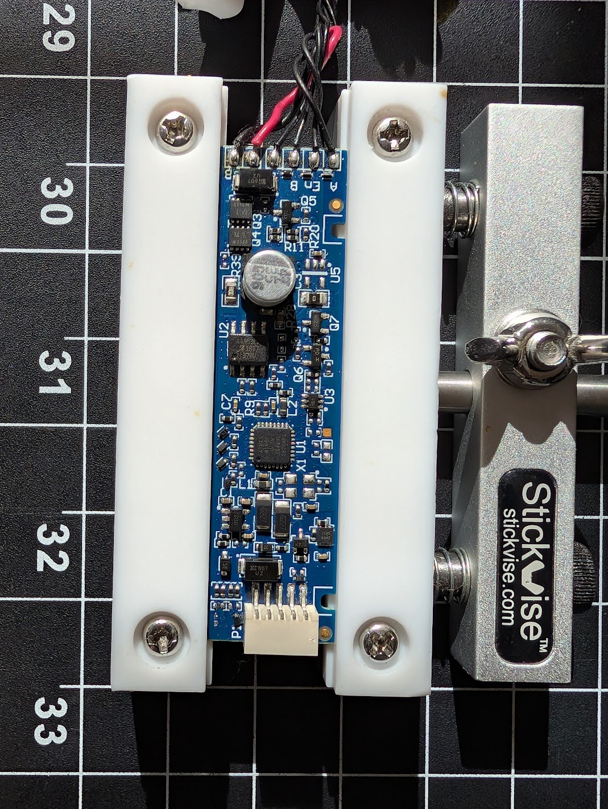
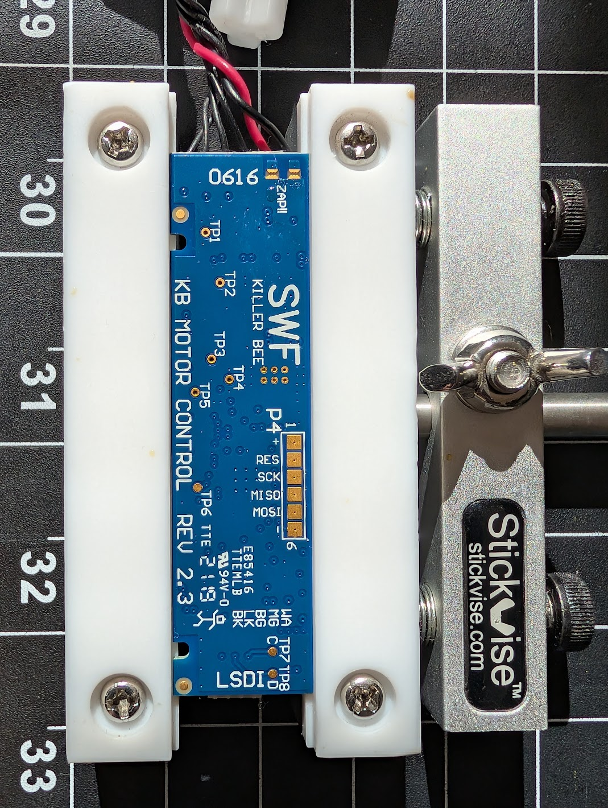
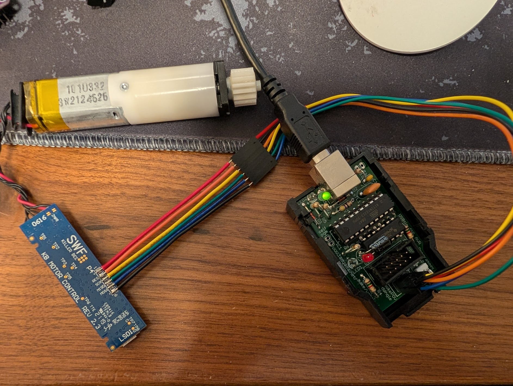

# Killer Bee — SWF Motor Control board (ATmega168P)

The **Killer Bee** is the motor-control board inside the blind. The
[CSZ1 controller](../csz1-control-board/README.md) commands it over I²C; it drives
the DC motor and reports position back. This document covers its purpose, MCU, how
its firmware was dumped, the pin/peripheral map, and the firmware-side view of the
I²C protocol. The inter-board wire protocol (captured from the master side) is in
the [protocol doc](../docs/PROTOCOL.md).

Part of the [Springs Window Fashions Z-Wave blind project](../README.md).

## Overview

- **Board:** `SWF Killer Bee Motor Control Rev 2.3`
- **MCU:** Microchip/Atmel **ATmega168P** (16 KB flash, 1 KB SRAM, 512 B EEPROM)
- **Clock:** internal 8 MHz RC, `CLKPR = 0` (prescaler ÷1) → **8 MHz**
- **Role:** drives the DC motor (H-bridge), reads two hall sensors + a magnet for
  position, senses motor current, and answers the control board as an **I²C slave**.

> Status: the **firmware was dumped** (chip was unlocked) and analysed in Ghidra.
> The peripheral/pin map and I²C slave framing below are read directly from the
> firmware and cross-checked against the master-side captures in `../docs/PROTOCOL.md`
> (slave address **0x0B** matches). Items marked *(hypothesis)* — chiefly which
> H-bridge leg is "open" vs "close" and the exact connector→pin mapping — are
> inferred and not yet bench-confirmed.

## Photos



Top side: the ATmega168P with the motor H-bridge and its bulk electrolytic cap,
the power leads at the top edge, and the white motor/sensor connector at the
bottom.



Bottom side, with the board marking *SWF / KILLER BEE / KB MOTOR CONTROL / REV
2.3 / LSDI*. The `P4` pad row is the **6-pad AVR ISP header** (`+ / RES / SCK /
MISO / MOSI / -`) used for the dump below; `TP1…TP8` are test points.



Reading flash + EEPROM with a **USBtinyISP** (right) over a ribbon to the 6-pad
ISP header — the `avrdude` command below.

---

## Dumping the firmware

The board exposes a 6-pad AVR ISP header: `+ / res / sck / miso / mosi / -`
(VCC / RESET / SCK / MISO / MOSI / GND). Read with a **USBtinyISP** (USB
`1781:0c9f`) and `avrdude`:

```bash
avrdude -c usbtiny -p m168p \
  -U flash:r:flash.bin:r   -U eeprom:r:eeprom.bin:r \
  -U lfuse:r:lfuse.txt:h    -U hfuse:r:hfuse.txt:h \
  -U efuse:r:efuse.txt:h    -U lock:r:lock.txt:h
```

Linux udev rule for non-root access:
```
SUBSYSTEM=="usb", ATTR{idVendor}=="1781", ATTR{idProduct}=="0c9f", MODE="0666"
```

Read result (verified stable across two reads):

| Item | Value | Note |
|:--|:--|:--|
| Flash | 16 KB image, ~15.5 KB used | `flash.bin` |
| EEPROM | 512 B | `eeprom.bin` |
| Lock bits | `0xFF` | **Unlocked** — why the dump succeeded |
| lfuse | `0xE2` | internal 8 MHz RC, CKDIV8 off |
| hfuse | `0xDE` | BOOTRST etc. |
| efuse | `0xF9` | BOD |

### Ghidra import

`AVR8:LE:16:default`, compiler **gcc**, image base `code:0000`.

> **Gotchas that bite hard on this target:**
> - Ghidra's stock `avr8:LE:16:default` ships a **generic ATmega128-style SFR map**
>   and a **wrong interrupt-vector model** (it assumes 1-word `RJMP` vectors; the
>   '168P uses 2-word `JMP` vectors). Both were corrected by hand — the SFR labels
>   were rebuilt for the '168P map, the I/O block set volatile, and the vector
>   table re-derived. Without this the decompiler reads the wrong registers and
>   mislabels every ISR.
> - The `code` address space is **word-addressed** (addressable unit = 2 bytes).
>   Scripts must use `addressFactory.getAddress("code:" + hex)` for word addresses;
>   `code.getAddress(long)` treats the arg as bytes and halves offsets.

---

## Pin / peripheral map

ATmega168P (TQFP/QFN), 8 MHz. "Conf." = confidence.

| Pin(s) | Peripheral | Role | Conf. |
|:--|:--|:--|:--|
| **PC4 / PC5** | TWI SDA / SCL | **I²C slave @ 0x0B** to the Z-Wave board (hardware TWI, interrupt-driven) | high |
| **PD0 / PD1** | USART0 RXD / TXD | 9600 8N1, RX+TX, polled — debug/aux serial | high |
| **PD5** | Timer0 **OC0B** | Motor H-bridge PWM leg | high |
| **PD6** | Timer0 **OC0A** | Motor H-bridge PWM leg (opposite direction to PD5) | high |
| **PB1** | GPIO | Motor H-bridge **enable / brake** (driven high to enable, low to release) | med-high |
| **PB0** | Timer1 **ICP1** + PCINT0 | **Hall channel A** — input-capture for pulse period (speed) + pin-change | high |
| **PB3** | PCINT3 | **Hall channel B** — second quadrature channel | high |
| **PD7** | GPIO (out) + read | **Hall-sensor power enable** (driven high before reading halls; also read as gate in PCINT0 ISR) | med |
| **PD2** | **INT0** (rising edge) | Wake / event from master ENABLE line *(hypothesis)*; ISR stops motor & re-arms | med |
| **ADC6** | ADC (AVcc ref, ÷64, polled) | **Motor current sense** (stall/obstacle, accumulated/averaged) | med |
| **PC2** | GPIO (in) | unidentified input | low |
| — | Timer2 (÷1024, OVF IRQ) | ~30 Hz **system tick** / sleep-wake | high |
| — | Watchdog (~1 s) | reset if the superloop stalls | high |

No external support chips are referenced by the firmware (no off-chip EEPROM or
gate driver in software) — the H-bridge is driven directly from MCU pins, and the
only peer on a bus is the Z-Wave radio over I²C.

---

## Motor drive

Direction is selected by which leg carries the PWM; the other leg is parked. Both
legs are **Timer0 fast-PWM** outputs at ~31 kHz (`TCCR0B` clk ÷1).

- `motor_drive_dirA_pd6` — enable **OC0A on PD6**, `OCR0A = 10` start duty.
- `motor_drive_dirB_pd5` — enable **OC0B on PD5**, `OCR0B = 10` start duty.
- `motor_pwm_legA_off_pd6` / `motor_pwm_legB_off_pd5` — disconnect a leg
  (clear the `COM0x` bits, set the pin back to input).
- `motor_legs_drive_high` / `motor_legs_drive_low` — both legs static
  (`DDRD |= 0x60` then drive PD5/PD6 together) — brake/coast states.
- `hbridge_enable_pb1_high` / `hbridge_disable_pb1_low` — PB1 enable line.
- `motor_stop_idle` — full stop: legs to input, then drive PD7 high (sensor power)
  and snapshot the hall lines.

Which leg maps to *open* vs *close* is not yet bench-confirmed *(hypothesis)*; the
master-side sign convention (`../docs/PROTOCOL.md`: negative = open, positive = close) is
the reference once correlated.

The `TIMER0_COMPA`/`COMPB` ISRs simply reload `OCR0A`/`OCR0B` from a stored value
(register R15, initialised 0) — a soft duty-update hook.

## Position sensing

- **Quadrature decode** (`hall_quadrature_decode`): reads `PINB & 0x09` (PB0 +
  PB3), forms a 2-bit Gray-code state, and shifts it into a history byte in the
  state struct. Pin-change interrupt **PCINT0** is armed on exactly those two pins
  (`PCMSK0 |= 0x09`, `PCICR |= 1`).
- **Speed / pulse timing**: Timer1 runs at clk ÷64; the **input-capture ISR**
  latches `ICR1` into `icr1_capture_lo/hi` and flags it. PB0 doubles as ICP1.
- **Current**: ADC channel 6, AVcc reference, ÷64 clock, polled in the superloop;
  accumulated/averaged into the state struct (stall / end-of-travel detection).

---

## I²C — slave side (firmware view)

This confirms and complements `../docs/PROTOCOL.md` (which was captured from the master).

- **Hardware TWI slave**, **not** bit-banged (the *master* bit-bangs; this side
  uses the '168P TWI peripheral).
- `twi_slave_init`: `TWAR = 0x16` → **7-bit slave address 0x0B** (TWGCE=0, no
  general call). `TWCR = 0xC5` = `TWEN | TWEA | TWIE | TWINT` (enabled, auto-ACK,
  interrupt-driven).
- **ISR `isr_TWI`** is a standard AVR TWI slave state machine on `TWSR & 0xF8`:

  | TWSR | State | Firmware action |
  |:--|:--|:--|
  | `0x60` | SR: own SLA+W, ACK | addressed for write; reset buffer index |
  | `0x80` | SR: data RX, ACK | store byte at `twi_buf[5+idx]`, bump write index `twi_buf[2]`, fold byte into the **SMBus PEC** (`twi_pec = crc8_smbus_table[twi_pec ^ byte]`); **first byte = register/command** (`twi_reg_addr`) |
  | `0x88` | SR: data RX, NACK | — |
  | `0xA0` | SR: STOP / repeated START | end of write; latch command for the superloop (`twi_write_cmd_dispatch`) |
  | `0xA8` | ST: own SLA+R, ACK | addressed for read; `twi_read_response_dispatch` loads response |
  | `0xB8` | ST: data TX, ACK | send next response byte |
  | `0xC0`/`0xC8` | ST: last byte sent | transmit the computed PEC (`twi_pec`) as the trailing byte |

- **Buffer / state in SRAM** (labelled in Ghidra):

  | Addr | Label | Meaning |
  |:--|:--|:--|
  | `0x025A` | `twi_buf` | RX/TX frame buffer base (layout below) |
  | `0x025C` | `twi_reg_addr` | register / command byte (first byte of a write) |
  | `0x025D` | `twi_state_flags` | TWI bookkeeping bits |
  | `0x025E` | `twi_pec` | running **SMBus PEC** (CRC-8); == `twi_buf[4]`. Transmitted as the trailing PEC byte on reads |
  | `0x025F` | `twi_cmd_pending` | command latched for the superloop dispatcher |
  | `0x02C9` | `device_id_len` | length of the ID string returned by reg `0x9B` |
  | `0x02CA` | `device_id_str` | ID-string buffer (block-read for reg `0x9B`) |
  | `0x033F` | `twi_parse_status` | frame-parser error/status code (0 = ok; 4/6 = length/PEC fail) |

- **`twi_buf` frame layout** (base `0x025A`):

  | Offset | Use |
  |:--|:--|
  | `[0]` | (scratch / not yet identified) |
  | `[1]` | TX read index (bytes already sent on a read) |
  | `[2]` | RX write index (bytes received on a write) |
  | `[3]` | transaction phase, low 3 bits (`& 0x07`): `2` = write, `3` = read (`twi_frame_phase_buf3`) |
  | `[4]` | **PEC accumulator** = `twi_pec` (`0x025E`) |
  | `[5…]` | data bytes (`[5]` = register/command on a write) |

- **PEC — CONFIRMED table-driven CRC-8/SMBus (poly 0x07):** the ISR maintains the
  PEC incrementally, one byte per `0x80` (data-RX) state, with the canonical
  table step

  ```
  twi_pec = crc8_smbus_table[ twi_pec ^ rx_byte ]      // crc = table[crc ^ data]
  ```

  - **Lookup table** `crc8_smbus_table` lives at **`code:0034`** (flash byte
    offset `0x68`, immediately after the 26-entry vector table); 256 bytes,
    `00 07 0E 09 1C 1B 12 15 …` — the standard CRC-8/SMBus table for poly `0x07`.
    Verified byte-for-byte against a generated table.
  - **Per-byte fetch** `crc8_pec_lookup` (`code:0CCC`): `twi_pec = *(0x68 + index)`
    via `LPM`, index passed in `Z`.
  - On a **read**, the accumulated `twi_pec` is what the slave clocks out as the
    trailing PEC byte (`0xC0`/`0xC8` states) — so the same routine produces the
    outgoing PEC.
  - **End-to-end verified:** re-deriving this CRC over the captured wire bytes
    reproduces every PEC in `up_down.csv` (26/26 frames) — see `../docs/PROTOCOL.md`.
  - Frame-level validation also parses a descriptor and checks the byte **count**
    (`frame[6]`) plus the received **PEC at `frame[4]`** (`twi_get_pec_byte_buf4`),
    setting `twi_parse_status` to a nonzero error code (`4` = length, `6` = PEC) on
    mismatch.

### Register dispatch — wire code *is* the opcode

The register/command byte (`frame[5]`) is dispatched by two functions with **no
remap** — the wire code is the internal opcode. The **complete opcode map (read +
write, all ~30 codes, payload shapes and semantics) now lives in `../docs/PROTOCOL.md`**;
this section records the firmware-side handlers and SRAM/EEPROM sources.

- **`twi_read_response_dispatch`** (`code:00f2`, TWI `0xA8` SLA+R) — switch on
  `(opcode + K) == 0`; each case validates the request, stages response bytes at
  `frame[0x28..]`, count at `frame[0]`. Notable handlers/sources:

  | Wire code | Handler / source |
  |:--|:--|
  | `0x7A` | `get_status_word_7a` — 2-byte status/limits word from `motor_state` |
  | `0x8B` | `build_telemetry_8b` — 2-byte telemetry: `(u16@0x0319 * gain@0x02b7) >> 13 ± offset@0x02b9` (Q13 linear cal); `0x8080` = not-ready sentinel |
  | `0x9B` | block copy of `device_id_str` (len `device_id_len`) |
  | `0xA1` | u32 from **EEPROM[0x70]** (= 0) |
  | `0xA2` | u32 from **EEPROM[0x78]** (= 117) — *not* position (old note was wrong) |
  | `0xA3` | u32 from **EEPROM[0x74]** (= 576, full travel) |
  | `0xA4` | i32 from **SRAM `0x0305` = `motor_state[0x19..0x1C]`** — live position |
  | `0x99`/`0x9D`/`0x9E` | `copy_block_to_response` (block reads of internal buffers) |
  | `0xB0` | `compute_response_b0` (32-bit math) |

  `0xA1/0xA2/0xA3` are exactly three of the EEPROM `int32[4]` block at `0x70`
  (above); `0xA4` is the live RAM position.

- **`twi_write_cmd_dispatch`** (`code:0263`, TWI `0xA0` STOP) — latches a command
  for the superloop. **Many write codes are gated on `GPIOR1` bit `0x10`** (a
  "calibrated/armed" flag) and no-op when clear — these are provisioning commands.
  Notable handlers:

  | Wire code | Handler / effect |
  |:--|:--|
  | `0xD1` | `twi_cmd_D1_move` — **MOVE**, requires `frame` count == 4 (i32 delta); clears the ADC accumulator |
  | `0xD2` | `twi_cmd_d2_move_setup` — sibling of D1, count == 4, target = 600 |
  | `0xD0` | `motor_direction_setup` — spawn motion; `GPIOR0|=0x10`, `GPIOR1&=0xFB` |
  | `0x01` | arm motion: `GPIOR0|=0x80`, `GPIOR1|=0x08` |
  | `0x00` | control/magic: a staged magic word triggers `Reset()` (`0x59xx`) or **enters the I²C firmware-update bootloader** (`twi_bootloader_loop` @ `code:1c00`, `0x90xx`) — see "Bootloader" below |
  | `0xC0` | `twi_cmd_c0_eeprom_write` (*calibrated*) — **raw EEPROM byte write**: addr = payload[7:8], data = payload[9]; else shares the `0xD0` motion path |
  | `0x9A`/`0x9B` | *calibrated*: copy a 19-byte payload into `device_id_str` + target write |

  `0x03` is **not** handled; unknown opcodes set `twi_parse_status` nonzero.

### Superloop command dispatch

`main` polls `GPIOR2.4` for a latched command, loads `twi_cmd_pending`, and
dispatches on the **same** opcodes. `GPIOR0/1/2` are used throughout as cheap
bit-flag registers (motion state, event-pending, sensor-valid, calibrated, etc.).
The large unnamed `code:11d8` is the superloop motor-control worker (walks
`motor_state`, drives the H-bridge, checks limits). It is now named
**`motor_run_step`** (`code:11d8`): per-iteration servo step — latches the
commanded direction (`motor_state+0x3` bit7 → `GPIOR1.6`), steps the live 32-bit
position toward target, drives the selected leg with Timer0 PWM (dir-A = OC0A/PD6,
dir-B = OC0B/PD5, enable = PB1), and terminates on the armed flag (`GPIOR0.4`) +
stall/limit flags (`GPIOR2.1/.2/.3`).

---

## I²C firmware-update bootloader

The board ships an **in-application bootloader reached over the I²C/TWI slave
interface** — not a separate boot section invoked at reset, but a routine entered
from normal operation. Write opcode `0x00` with magic word `0x90xx` jumps into
**`twi_bootloader_loop`** (`code:1c00`), which **never returns**.

- **`twi_bootloader_loop`** (`code:1c00`): after `bootloader_reset_peripherals`
  (stops the watchdog, clears TWI/timers/EEPROM/sleep, re-inits the clock
  prescaler) it busy-waits on `TWCR.TWINT`. Each received byte is fed to
  `twi_bootloader_byte_handler`; an inactivity counter (`motor_state+0x21/+0x22`,
  reused here as a 16-bit timeout — **not** a motor counter) disarms the session
  on timeout. The command byte `motor_state+0x24` selects the action.
- **`twi_bootloader_byte_handler`** (`code:1c5e`): per-byte TWI-slave state machine
  for the download — captures address/command, streams the payload into an SRAM
  buffer (page `0x031x`), and transmits response bytes back.
- **`twi_bootloader_build_status_frame`** (`code:1ce6`, cmd `0x02`): builds an
  0x89-byte status/response frame (header + 0x80-byte data block) and XOR-checksums
  it into `motor_state+0x07`.
- **`twi_bootloader_flash_write_exec`** (`code:1d40`, cmd `0x04`): the flash
  programmer — verifies the buffered block (via `xor_checksum_byte`) and **writes
  it to program flash using `spm`** (5 `spm` + 1 `lpm` in the body; this is the
  definitive proof it is a bootloader, not a motor loop as earlier notes assumed).
- `DAT_mem_0266` is a software call-trace breadcrumb written before each sub-call
  (crash diagnostics).

> Practical note: this is a write path into program flash gated only by the
> `0x90xx` magic word over I²C — relevant for both firmware recovery and as an
> attack-surface observation. Frame layout (download/verify/program commands) is
> not yet fully mapped.

---

## Memory / state

A single state struct lives at **`0x02EC`** (loaded by `load_state_ptr_02ec`,
held in X/Z across the superloop). It is defined in Ghidra as **`motor_state_t`**
(0x40 bytes) and applied to the `motor_state` global; `load_state_ptr_02ec` now
returns `motor_state_t *`. Field accesses elsewhere go through the X/Z registers,
which Ghidra's AVR model does not auto-retype, so the offsets below remain the
reference. Observed/used field offsets:

| Offset | Use (inferred) |
|:--|:--|
| `0x09` | direction / mode byte |
| `0x0E–0x0F` | target position (set by `0x9A`) |
| `0x11–0x14` | 32-bit position-related field (internal; *not* the wire position) |
| `0x19–0x1C` | **absolute position, 32-bit** — this is what read code `0xA4` returns (SRAM `0x0305`); `load_position_field_0x19` |
| `0x1D–0x1F` | target / mode latches |
| `0x20` | superloop event flags (watchdog, housekeeping bits) |
| `0x26` | status/limits byte (bit6, bit7 tested) |
| `0x2D–0x2E` | ADC current accumulator |
| `0x32–0x35` | hall quadrature history / snapshot |

`load_config_from_nvm` populates offsets `0x00..0x3F` at boot (from EEPROM/NVM —
this is where the persistent parked position comes from, matching `../docs/PROTOCOL.md`'s
note that `0xA4` survives power cycles and the board does **not** re-home).

---

## EEPROM (`eeprom.bin`, 512 B)

The MCU's internal EEPROM is the persistent store. Read/written through a small
polled library (renamed in Ghidra), with the **byte address held in the register
pair `R20:R21`** as an auto-incrementing cursor:

| Function | Role |
|:--|:--|
| `eeprom_wait_ready` (`code:16E4`) | spin while `EECR.EEPE` (write in progress) |
| `eeprom_set_addr_and_read` (`code:16E9`) | `EEAR = R20:R21`, set `EERE` — read byte at cursor |
| `eeprom_inc_addr_and_read` (`code:16E7`) | `R20:R21++` then read — next sequential byte |
| `eeprom_read_u8 / _u16 / _u32` | read 1 / 2 / 4 sequential bytes → `R16` / `R16:R17` / `R16..R19` (**little-endian**) |
| `eeprom_set_addr_and_write` (`code:1701`), `eeprom_write_u8 / _u16 / _u32` | `EEDR = Rn`, set `EEMPE` then `EEPE` |
| `eeprom_copy_byte_to_sram` (`code:1195`) | read cursor byte → `*X++`, cursor++, `R17--` (Pascal-string copy loop) |

`*_wN` are thin call-site wrapper variants of the same primitive.

### Boot sequence — `load_config_from_nvm` (`code:1060`)

1. **Copy device-info strings** EEPROM → SRAM (the strings surfaced by the `0x9B`
   block read).
2. **Self-healing config:** read a *config-valid bitmask* and, for every bit that
   is **clear**, write that field's compile-time default back to EEPROM. On a
   fully-provisioned board every bit is set, so the default-write path is skipped
   and learned values are preserved.
3. **Saved motion state:** read the **validity byte at `0x1FF`**; if it equals
   **`0xAA`**, restore the saved state block at `0x0D0…0x0DF` into `motor_state`;
   otherwise write defaults and stamp `0xAA`.

This is why position/calibration survive power cycles (and why the board does not
re-home): the values live in EEPROM behind a valid-bit + signature, not in flash.

### Layout (confirmed against the dump)

| Offset | Bytes | Meaning |
|:--|:--|:--|
| `0x00–0x2F` | `FF…` | erased |
| `0x33` | `06` + `"082015"` | length-prefixed lot/date code |
| `0x40` | `0F` + `" 20190726 0947."` | length-prefixed build/cal timestamp (**2019-07-26 09:47**) |
| `0x50` | `10` + `"5120199A12t"`(+pad) | length-prefixed serial / part id |
| `0x70` | `int32[4]` LE = `{0, 576, 117, 582}` | travel calibration; **`0x74` = 576 = the full-travel range reported by reg `0xA3`** |
| `0x80–0xBF` | mixed | config-valid mask + per-field values (the lazy-default fields above) |
| `0xD0–0xDF` | state block | saved motion state (gated by `0x1FF`); `0xDE` = `0x0258` = **600** |
| `0x100` | ASCII | `"AKIA"`, `"MotorDriveBoard"`, `"Rstack=30"`, `"Cstack=255"` — build/config text |
| `0x1FF` | `AA` | **validity signature** (checked at boot) |

> `576` (full travel) appears here as a 32-bit constant and is also the reg `0xA3`
> response, while the live absolute position (reg `0xA4`) is the value that moves;
> `582`/`117` in the same block are travel-related calibration (exact roles not yet
> bench-confirmed).

---

## Files

| File | What |
|:--|:--|
| `flash.bin` | ATmega168P flash image (16 KB) |
| `eeprom.bin` | EEPROM (512 B) |
| `{l,h,e}fuse.txt`, `lock.txt` | Fuse / lock byte reads |
| `images/` | board / device photos |

---

## Open items

- [x] ~~Trace `twi_reg_addr` → internal opcode mapping~~ — **resolved**: the wire
      register code *is* the internal opcode (no remap). Both
      `twi_read_response_dispatch` and `twi_write_cmd_dispatch` switch directly on
      it; verified against `../docs/PROTOCOL.md` (0x7A/0x8B/0x9B/0xA1/0xA3/0xA4/0xD1).
- [x] ~~Pin the exact on-chip **CRC-8 (poly 0x07)** routine~~ — **resolved**:
      table-driven CRC-8/SMBus. Table `crc8_smbus_table` @ `code:0034` (flash
      `0x68`), per-byte fetch `crc8_pec_lookup` @ `code:0CCC`, accumulator
      `twi_pec` (`twi_buf[4]`/`0x025E`), folded in the `isr_TWI` `0x80` state as
      `twi_pec = table[twi_pec ^ byte]` and clocked out as the trailing PEC on reads.
- [ ] Confirm which H-bridge leg (PD5/OC0B vs PD6/OC0A) is *open* vs *close*.
- [ ] Confirm PD2/INT0 role. Firmware re-analysis now **leans end-stop/fault, not
      a host ENABLE/wake**: `isr_INT0` (rising-edge, `EICRA` ISC0=11) stops Timer0,
      tristates/disables the H-bridge (`hbridge_disable_pb1_low`), snapshots the
      `PINB&9` hall lines, and persists position — i.e. a stall/limit/feedback edge.
      Bench-confirm what physically drives PD2.
- [x] ~~Type the `0x02EC` state struct in Ghidra~~ — done: `motor_state_t` defined
      and applied to the `motor_state` global; `load_state_ptr_02ec` returns it.
      (Per-function X/Z pointer accesses still show raw offsets — the AVR register
      model doesn't propagate the type automatically.)
- [x] ~~Decode the EEPROM contents (`eeprom.bin`) against `load_config_from_nvm`~~ —
      **resolved**: see the *EEPROM* section. Polled access library mapped (cursor
      `R20:R21`, LE u8/u16/u32 read/write), boot logic decoded (device strings →
      self-healing config-valid mask → `0xAA`-gated saved-state block at `0x0D0`),
      and the dump annotated (mfg strings, the `int32[4]` travel block with
      `0x74`=576=reg`0xA3`, validity byte `0x1FF`=`0xAA`).
- [~] `0x8B` telemetry — **math resolved, units open**. `build_telemetry_8b`
      (`code:09f6`) computes `(u16@0x0319 * gain@0x02b7) >> 13 ± signed offset@0x02b9`
      (Q13-fixed-point linear calibration), with `0x8080` returned as a not-ready
      sentinel (when `src==0x8080` or `GPIOR0.3` set). Remaining unknowns: (a) `gain`
      and `offset` live in runtime SRAM with no flash initializer, so absolute units
      (mV/mA/counts) need a **bench read** of `0x02b7`/`0x02b9` (or the EEPROM cal
      block that seeds them); (b) the prior "ADC-derived" label for `0x0319` is **not
      corroborated** — `0x0319` sits in the position/motion variable cluster, while
      the ADC accumulator is `motor_state+0x2D`. The single ADC channel (ADC6, AVcc
      ref, /64, polled in `main`, 32-sample sum) is a separate path; whether `0x0319`
      ultimately carries a processed ADC reading is unconfirmed.
- [x] ~~Decode the full read/write opcode set~~ — **resolved**: all ~30 dispatcher
      opcodes decoded and documented in `../docs/PROTOCOL.md`; handlers named in Ghidra.
- [x] ~~Identify the large unnamed superloop/motor functions~~ — **resolved**:
      `motor_run_step` (`code:11d8`, servo step), `twi_xfer_result_dispatch`
      (`code:12ff`), `motor_finalize_position_to_nvm` (`code:13db`), and the I²C
      bootloader cluster (`code:1c00/1c5e/1ce6/1d40`) all named + commented. The
      `code:1c00` cluster is the **firmware-update bootloader** (see section above),
      correcting an earlier note that called it a motor poll loop.
